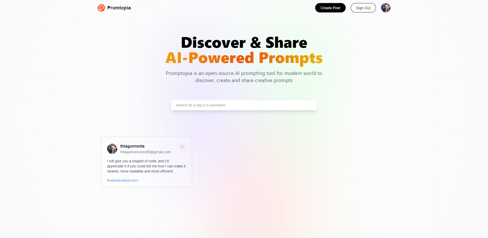

<h1 align="center"> Promptopia </h1>

Projeto desenvolvido com Next.js 13, com base nos ensinamentos do vídeo - [Next.js 13 Full Course 2023 | Build and Deploy a Full Stack App Using the Official React Framework](https://youtu.be/wm5gMKuwSYk) do canal [@javascriptmastery](https://www.youtube.com/@javascriptmastery) no Youtube. 

<p align="center">
  <a href="#-tecnologias">🚀 Tecnologias</a>&nbsp;&nbsp;&nbsp;|&nbsp;&nbsp;&nbsp;
  <a href="#-projeto">💻 Projeto</a>&nbsp;&nbsp;&nbsp;|&nbsp;&nbsp;&nbsp;
  <a href="#-instruções"> 📋 Instruções</a>&nbsp;&nbsp;&nbsp;|&nbsp;&nbsp;&nbsp;
  <a href="#-layout">🔖 Layout</a>&nbsp;&nbsp;&nbsp;|&nbsp;&nbsp;&nbsp;
  <a href="#-licença">📝 Licença</a>
</p>

<br>

<p align="center">
  
</p>

## 🚀 Tecnologias

Esse projeto foi desenvolvido com as seguintes tecnologias:

- [Google Cloud](https://console.cloud.google.com/)
- [MongoDB](https://www.mongodb.com/)
- [Next.JS](https://nextjs.org/)
- [NodeJS](https://nodejs.org/)
- [React](https://react.dev/)


<br>

## 💻 Projeto

Promptopia é um site que visa agrupar os melhores prompts de comando para serem utilizados em sites que se utilizam de inteligência artificial. Os usuários tanto podem postar as melhores opções que eles encontraram, quanto pedirem sugestões para situações específicas. Neste projeto foi utilizado o [MongoDB](https://www.mongodb.com/) para gerenciar o banco de dados, [Google Cloud](https://console.cloud.google.com/) para o login dos usuários, além do [Next.JS](https://nextjs.org/), framework para React, que contribui para a produção de código priorizando a eficiência de tempo.

## 📋 Instruções

### Clone o projeto e acesse a pasta.

```bash
$ git clone https://github.com/ThiagoMonts/promptopia.git
```
```bash
$ cd promptopia
```

<br>

### Siga o passo a passo:

Instale as dependências
```bash
$ cd promptopia
```
```bash
$ npm install
```

<br>

Inicie o projeto
```bash
$ npm start
```

<br>

Crie um arquivo .env e crie suas credenciais.

<br>

## 🔖 Layout

Você pode acessar o site através [DESSE LINK](https://thiagomonts-promptopia.vercel.app/).

<br>

## 📝 Licença

Esse projeto está sob a licença MIT.

---

Desenvolvido por [Thiago Honorato](https://www.linkedin.com/in/honoratothiago/)
